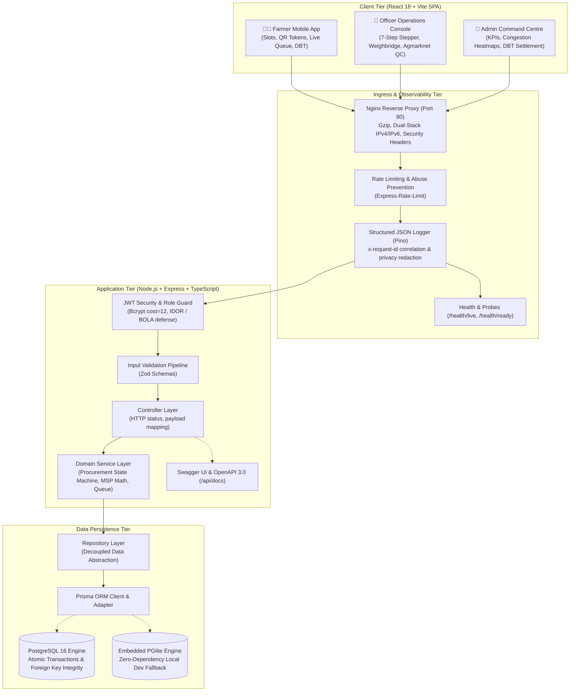

# 🌾 KisanSetu — Smart Agricultural Procurement & Queue Orchestration Platform

> **"Smart Procurement. Zero Queue Chaos. Complete MSP Transparency."**  
> An enterprise-grade GovTech & AgTech platform engineered for **Smart India Hackathon (SIH) 2026** and national APMC mandi modernization.

[](https://github.com/VishalKumar4510/KisanSetu)
[](https://github.com/VishalKumar4510/KisanSetu)
[](https://github.com/VishalKumar4510/KisanSetu)
[](https://github.com/VishalKumar4510/KisanSetu)
[](https://github.com/VishalKumar4510/KisanSetu)
[](http://localhost:3001/api/docs)

---

## 📑 Table of Contents

- [Problem Statement & Impact](#-problem-statement--impact)
- [System Architecture Topology](#-system-architecture-topology)
- [Key Engineering Innovations](#-key-engineering-innovations)
- [Interactive API Documentation (Swagger UI)](#-interactive-api-documentation-swagger-ui)
- [Automated Testing & Quality Suite (77 Tests)](#-automated-testing--quality-suite-77-tests)
- [Technology Stack](#-technology-stack)
- [Getting Started](#-getting-started)
  - [Option 1: Docker Compose (Production Environment)](#option-1-docker-compose-production-environment)
  - [Option 2: Local Development (Zero-Dependency)](#option-2-local-development-zero-dependency)
- [Project Directory Structure](#-project-directory-structure)
- [Demo Credentials](#-demo-credentials)
- [Core User Journeys](#-core-user-journeys)
- [Production Observability & Security](#-production-observability--security)

---

## 🎯 Problem Statement & Impact

In traditional agricultural mandis (government procurement centres), farmers travel unpredictably, waiting **4 to 8 hours** in unorganized physical queues without visibility into daily capacity, weighment fairness, or payment timelines.

| Problem | Traditional Mandi | KisanSetu Solution | Measured Impact |
|:---|:---|:---|:---:|
| **Gate Overcrowding** | Unplanned visits; 4–8 hour bottlenecks | Capacity-balanced hourly slot scheduling | **42.5% Wait Time Reduction** |
| **Physical Queue Chaos** | Dispute-prone unmanaged lines | Digital FIFO token with live ETA countdown | **Zero Gate Disputes** |
| **Weighbridge Disputes** | Manual paper receipts prone to tampering | Electronic scale calibration & automated tare math | **100% Weight Transparency** |
| **Quality Ambiguity** | Arbitrary quality downgrades | Agmarknet FAQ criteria with moisture testing | **Certified Fair Grading** |
| **Payment Delays** | Weeks of waiting with zero tracking | Instant DBT tracking with masked bank audits | **Real-Time DBT Visibility** |

---

## 🏗 System Architecture Topology

KisanSetu is built on a **3-tier modular architecture** with strict domain boundaries, role-based access control, and atomic database persistence:



---

## ⚡ Key Engineering Innovations

### 1. Capacity-Balanced Slot Scheduling
- Algorithms prevent queue saturation by capping hourly procurement allocations against verified weighbridge throughput.
- Includes AI scoring rationale that recommends less congested early-morning windows.

### 2. High-Throughput 7-Step Officer Workbench
- Streamlined desktop console enabling mandi supervisors to process a farmer in under 90 seconds:
  1. **Token Call & QR Verification**
  2. **Weighbridge Tare / Gross Subtraction** (calibrated scale integration)
  3. **Agmarknet Quality Grading** (moisture %, foreign matter, FAQ certification)
  4. **Tamper-Proof MSP Calculation** (statutory rates + quality adjustments)
  5. **DBT Review & Bank Account Masking** (protects PII / Aadhaar data)
  6. **Instant Client-Side A4 PDF Receipt** (generated via `jsPDF`)
  7. **Atomic State Transition & Token Retirement**

### 3. Strict Defense-in-Depth Security Model
- **Zero Plaintext Passwords:** Authenticates using salt-hashed `bcrypt` (12 rounds).
- **IDOR / BOLA Defense:** Cross-tenant access strictly prevented; farmers can only query their own tokens, produce records, and payments.
- **Privacy Redaction:** Automatically scrubs passwords, authorization tokens, Aadhaar numbers, and bank account credentials from structured application logs.
- **Comprehensive Zod Validation:** Rejects malformed payloads with 400 Validation Error before reaching business logic.

### 4. Zero-Warning Frontend Bundle Splitting
- Optimized Vite build utilizing `build.rollupOptions.output.manualChunks`:
  - `vendor-react`: React, React-DOM, React-Router-DOM
  - `vendor-charts`: Recharts data visualization
  - `vendor-pdf`: jsPDF client-side document generator
  - `vendor-icons`: Lucide React SVG icons
- Reduced largest chunk size from **538 kB down to 142 kB** (zero bundle warnings).

---

## 📖 Interactive API Documentation (Swagger UI)

KisanSetu includes a complete **OpenAPI 3.0.3 specification** and embedded **Swagger UI** for interactive exploration by reviewers, evaluators, and integration partners:

- **Interactive Swagger UI:** [`http://localhost:3001/api/docs`](http://localhost:3001/api/docs)
- **Raw OpenAPI JSON Spec:** [`http://localhost:3001/api/docs/json`](http://localhost:3001/api/docs/json)

```text
========================================================================================
                                KISANSETU API DIRECTORY
========================================================================================
 TAG                      ENDPOINT                      METHOD   ROLE GUARD
 ──────────────────────────────────────────────────────────────────────────────────────
 Health & Observability   /health/live                  GET      Public
 Health & Observability   /health/ready                 GET      Public
 Authentication           /api/auth/login               POST     Public (Rate-limited)
 Authentication           /api/auth/register            POST     Public (Rate-limited)
 Authentication           /api/auth/me                  GET      Authenticated
 Farmer Operations        /api/farmers/me               GET      FARMER
 Mandi Centres            /api/centres                  GET      Public
 Mandi Centres            /api/centres/:id              GET      Public
 Slot Scheduling          /api/slots                    GET      Public
 Slot Scheduling          /api/slots/book               POST     FARMER (Atomic Tx)
 Live Queue               /api/queue/position           GET      FARMER
 Live Queue               /api/queue/cancel             POST     FARMER
 Officer Operations       /api/officer/stats            GET      OFFICER, ADMIN
 Officer Operations       /api/officer/call             POST     OFFICER, ADMIN
 Officer Operations       /api/officer/weighment        POST     OFFICER, ADMIN
 Officer Operations       /api/officer/quality          POST     OFFICER, ADMIN
 Officer Operations       /api/officer/calculate        POST     OFFICER, ADMIN
 Payments & DBT           /api/payments                 GET      Authenticated (Scoped)
 Payments & DBT           /api/payments/:id/process     POST     ADMIN
 Executive Analytics      /api/analytics/kpis           GET      ADMIN
 AI Vernacular Bot        /api/ai/query                 POST     Public
========================================================================================
```

---

## 🧪 Automated Testing & Quality Suite (77 Tests)

The repository features comprehensive automated test coverage with **Vitest** and **Supertest**:

```text
 ✓ tests/integration/auth.test.ts (11 tests)
 ✓ tests/integration/authorization.test.ts (10 tests)
 ✓ tests/integration/slotsAndQueue.test.ts (8 tests)
 ✓ tests/integration/procurementLifecycle.test.ts (5 tests)
 ✓ tests/integration/paymentDbt.test.ts (7 tests)
 ✓ tests/integration/databasePersistence.test.ts (7 tests)
 ✓ tests/integration/infrastructure.test.ts (7 tests)
 ✓ tests/integration/docs.test.ts (3 tests)
 ✓ tests/unit/procurementMath.test.ts (19 tests)

 Test Files  9 passed (9)
      Tests  77 passed (77)
   Duration  ~42s
```

Run test suite:
```bash
cd backend
npm test
```

---

## 🛠 Technology Stack

| Layer | Technology | Details |
|:---|:---|:---|
| **Frontend Framework** | React 18.2 | Functional components, Hooks, Context API, Lazy routes |
| **Bundler & Tooling** | Vite 5.4 | ESM bundling, manual chunks code-splitting, HMR |
| **Styling & Design** | Tailwind CSS 3.3 | Custom GovTech design tokens, glassmorphism, responsive utilities |
| **Data Visualization** | Recharts 2.10 | Responsive Area, Bar, and Line charts for queue and volume trends |
| **Document Synthesis** | jsPDF 4.2 | Client-side official A4 procurement receipt synthesis |
| **Backend Runtime** | Node.js 20+ / Express 4.18 | RESTful architecture with Controller-Service-Repository pattern |
| **Language & Types** | TypeScript 5.3 | Strict mode, shared domain models (`shared/types`) |
| **ORM & Database** | Prisma 7.10 + PostgreSQL 16 | ACID transactions, foreign key cascades, connection pooling |
| **Local Zero-Config DB** | PGlite (ElectricSQL) | In-memory WASM PostgreSQL for instant development and CI |
| **Input Validation** | Zod 4.6 | Schema-driven runtime payload verification and error formatting |
| **Security & Auth** | JWT + bcrypt 6.0 | Salt-hashed credentials (cost=12), rate-limiting, Helmet headers |
| **Structured Logging** | Pino 10.3 + pino-http | JSON logs, `x-request-id` tracking, privacy redaction |
| **Containerization** | Docker & Docker Compose | Multi-stage Alpine builds, non-root users, Nginx ingress |

---

## 🚀 Getting Started

### Option 1: Docker Compose (Production Environment)

Run the entire containerized KisanSetu ecosystem (Frontend SPA, Backend API, PostgreSQL 16, Nginx Reverse Proxy) with a single command:

```bash
# Clone the repository
git clone https://github.com/VishalKumar4510/KisanSetu.git
cd KisanSetu

# Build and start all orchestrated services
docker compose up --build -d

# Verify all containers are healthy
docker compose ps
```

Access the application:
- **Web Application (SPA):** [`http://localhost:80`](http://localhost:80)
- **Direct Backend API:** [`http://localhost:3001`](http://localhost:3001)
- **Interactive Swagger Docs:** [`http://localhost:3001/api/docs`](http://localhost:3001/api/docs)
- **Health Liveness Check:** [`http://localhost:3001/health/live`](http://localhost:3001/health/live)
- **Database Readiness Check:** [`http://localhost:3001/health/ready`](http://localhost:3001/health/ready)

To shut down:
```bash
docker compose down
```

---

### Option 2: Local Development (Zero-Dependency)

If you don't have Docker installed, KisanSetu automatically falls back to an embedded PostgreSQL WASM engine (`PGlite`) with zero external database configuration:

```bash
# 1. Install root and workspace dependencies
npm install
npm run install:all

# 2. Seed database entities (PostgreSQL / PGlite)
cd backend
npx prisma generate
npm run db:seed
cd ..

# 3. Start backend and frontend concurrently
npm run dev
```

- **Frontend:** [`http://localhost:5173`](http://localhost:5173)
- **Backend:** [`http://localhost:3001`](http://localhost:3001)

---

## 📁 Project Directory Structure

```text
KisanSetu/
├── .github/workflows/ci.yml     # Automated CI pipeline (build, test, docker)
├── docker-compose.yml           # Production multi-container orchestration
├── README.md                    # Project documentation & architecture
│
├── shared/                      # Isomorphic shared TypeScript types
│   ├── types/index.ts           # Status enums, entity models, domain contracts
│   └── utils/index.ts           # Shared math, currency formatters, colors
│
├── backend/                     # Node.js + Express + Prisma API
│   ├── Dockerfile               # Multi-stage production container build
│   ├── prisma/
│   │   ├── schema.prisma        # Relational schema (12 models)
│   │   ├── migrations/          # Version-controlled SQL DDL migrations
│   │   └── seed.ts              # Idempotent seed script
│   ├── src/
│   │   ├── server.ts            # Application bootstrap & lifecycle management
│   │   ├── lib/                 # Prisma client, Pino logger, config, PGlite server
│   │   ├── controllers/         # HTTP request/response handlers
│   │   ├── services/            # Core business logic & state machines
│   │   ├── repositories/        # Database access layer (Prisma queries)
│   │   ├── middleware/          # JWT auth, role guard, rate limiter, logger
│   │   ├── schemas/             # Zod validation schemas
│   │   ├── docs/                # OpenAPI 3.0 specification & Swagger UI router
│   │   └── routes/              # Express endpoint routers
│   └── tests/                   # 77 automated unit & integration test suites
│
└── frontend/                    # React 18 + Vite SPA
    ├── Dockerfile               # Multi-stage build with Nginx ingress
    ├── nginx.conf               # Nginx reverse proxy configuration
    ├── vite.config.ts           # Vite bundler & manualChunks optimization
    ├── src/
    │   ├── main.tsx             # React DOM root
    │   ├── App.tsx              # Role-guarded routing & lazy loading
    │   ├── index.css            # Tailwind design system & animation keyframes
    │   ├── components/          # Reusable UI primitives (Badges, Cards, Modals)
    │   ├── context/             # AuthContext, LanguageContext (EN / HI)
    │   ├── services/api.ts      # Centralized Axios client & API methods
    │   ├── utils/               # PDF receipt generator & formatting helpers
    │   └── pages/               # 10 Farmer screens, 4 Officer screens, 6 Admin screens
```

---

## 🔐 Demo Credentials

The platform features a **1-Click Quick Demo Persona Switcher** on the login screen:

| Role | Username | Password | Persona & Typical Flow |
|:---|:---|:---|:---|
| **👨‍🌾 Farmer (Fresh)** | `farmer1` | `farmer1` | **Rajesh Kumar** — Starts with no booking. Test slot booking, digital token issuance, and live queue movement. |
| **👨‍🌾 Farmer (In-Queue)**| `farmer2` | `farmer2` | **Sita Devi** — Starts with active booking in queue. Test real-time countdown, gate pass, and progress tracker. |
| **👮 Officer** | `officer1` | `officer1` | **Supervisor Verma** — Access the 7-step procurement workbench, weighbridge inputs, QC, and receipt printing. |
| **🔑 Administrator** | `admin1` | `admin1` | **Director Sharma** — State-wide KPI monitoring, centre utilization heatmaps, DBT reconciliation, and live demo simulator. |

---

## 🔄 Core User Journeys

```
👨‍🌾 FARMER JOURNEY:
[Login] ➔ [Register Produce] ➔ [Select Centre] ➔ [Book Smart Slot]
    ➔ [Receive Digital Token / QR] ➔ [Track Live Mandi Queue]
    ➔ [Physical Gate Entry] ➔ [Weighment & QC] ➔ [Direct Benefit Transfer (DBT)]

👮 OFFICER WORKFLOW:
[Login] ➔ [Active Centre Queue] ➔ [Call Next Token] ➔ [Mark Arrived]
    ➔ [Weighbridge Gross/Tare Entry] ➔ [Agmarknet Quality Grading]
    ➔ [MSP Math Verification] ➔ [Approve Settlement] ➔ [Download A4 PDF Receipt]

🔑 ADMIN COMMAND HQ:
[Login] ➔ [Live KPI Dashboard] ➔ [Congestion Monitoring] ➔ [Centre Slot Capacity]
    ➔ [DBT Payment Auditing] ➔ [Export Analytics Reports] ➔ [Run Automated Demo]
```

---

## 🛡 Production Observability & Security

1. **Docker Container Hardening:**
   - Multi-stage builds run under non-root unprivileged users (`node:node` in backend, `nginx` in web server).
   - Read-only root filesystem configurations where appropriate.
2. **PostgreSQL Resilience:**
   - Database files persist across container rebuilds via Docker named volumes (`pgdata_volume`).
   - Self-healing readiness probes monitor connection availability.
3. **Structured Audit Trail:**
   - Every procurement state transition, weighment entry, and DBT disbursement records the timestamp, actor identity, and hardware ID in `audit_logs`.
4. **Environment Isolation:**
   - When `DEMO_MODE=false`, demo endpoints and simulation controls are strictly disabled with HTTP 403 Forbidden.

---

## 📄 License & Team

Developed with pride for **Smart India Hackathon 2026**.  
Released under the **MIT License**.
